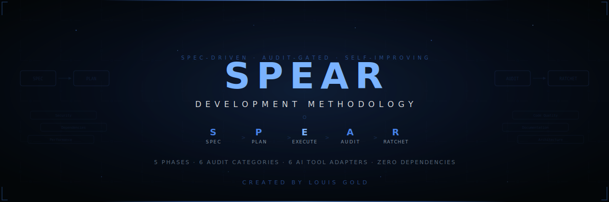

<div align="center">

<br />

<picture>
  
</picture>

<br /><br />


<br /><br />

&nbsp;
&nbsp;
&nbsp;
&nbsp;
&nbsp;
&nbsp;
&nbsp;


<br /><br />

**A spec-driven, audit-gated, self-improving development methodology for AI-assisted workflows.**<br />
Five phases. Seven audit categories. Browser automation. Integrated SAST. One direction: forward.

<br />

&nbsp;
&nbsp;
&nbsp;
&nbsp;


</div>

<br />

---

<br />

## The Problem

AI coding tools are powerful but chaotic. Without structure, they produce code that works today and breaks tomorrow:

> **No specification** — jumping straight to code without defining what or why
>
> **No audit gate** — shipping whatever the AI generates without independent review
>
> **No learning** — making the same mistakes because nothing is remembered
>
> **Tool lock-in** — methodology tied to one AI tool, useless with another

<br />

## The Solution

SPEAR is a drop-in methodology that adds structure, audit gates, and a learning ratchet to any AI-assisted workflow.

```
┌──────┐    ┌──────┐    ┌─────────┐    ┌───────┐    ┌─────────┐
│ SPEC │───>│ PLAN │───>│ EXECUTE │───>│ AUDIT │───>│ RATCHET │
└──────┘    └──────┘    └─────────┘    └───────┘    └─────────┘
```

<table>
<tr>
<td width="60"><b>S</b></td>
<td><b>Spec</b> — Socratic questioning to define what and why. One question at a time. Design validation before approval.</td>
</tr>
<tr>
<td><b>P</b></td>
<td><b>Plan</b> — Break into phases with fitness functions and success criteria.</td>
</tr>
<tr>
<td><b>E</b></td>
<td><b>Execute</b> — TDD-enforced (RED-GREEN-REFACTOR). Worktree isolation. 5-step verification gate. Subagent dispatch. Systematic debugging.</td>
</tr>
<tr>
<td><b>A</b></td>
<td><b>Audit</b> — Independent review across 7 categories including browser visual verification. GO/NO-GO verdict.</td>
</tr>
<tr>
<td><b>R</b></td>
<td><b>Ratchet</b> — Tighten thresholds, generate rules, remember decisions. Quality only goes up.</td>
</tr>
</table>

<br />

## 30-Second Install

```bash
curl -fsSL https://raw.githubusercontent.com/migueljnew-droid/spear-framework/main/install.sh | bash
```

> **Security note:** We recommend cloning and inspecting the installer before running it.

Or manually:

```bash
git clone https://github.com/migueljnew-droid/spear-framework.git
cp -r spear-framework/.spear your-project/.spear
cd your-project && ./install.sh
```

<br />

## The 7 Audit Categories

Every change is reviewed across seven independent, parallel categories. Each produces its own verdict.

<table>
<tr><th>Category</th><th>What It Checks</th></tr>
<tr><td></td><td>Secrets, injection, auth, OWASP Top 10, SAST (CodeQL + Semgrep), variant analysis, supply chain audit</td></tr>
<tr><td></td><td>CVEs, licenses, outdated packages, supply chain</td></tr>
<tr><td></td><td>Complexity, bundle size, queries, memory</td></tr>
<tr><td></td><td>Duplication, dead code, naming, error handling</td></tr>
<tr><td></td><td>API docs, README accuracy, changelog</td></tr>
<tr><td></td><td>Layer violations, circular deps, pattern consistency</td></tr>
<tr><td></td><td>Browser verification via CDP — console errors, failed requests, accessibility tree, visual rendering</td></tr>
</table>

**Severity levels:** `CRITICAL` (blocks deploy) → `HIGH` (fix or justify) → `MEDIUM` → `LOW` → `INFO`

<br />

## The Ratchet

The ratchet ensures **quality only goes up**. It tracks thresholds for metrics like test coverage, bundle size, and complexity:

- **Floor thresholds** (must stay above): test coverage ≥ 70%, doc coverage ≥ 60%
- **Ceiling thresholds** (must stay below): complexity ≤ 20, bundle ≤ 500kb
- **Auto-tighten**: When you exceed a threshold by 5%+, it ratchets to the new level (minus 2% buffer)
- **Never loosens silently**: Every threshold change is logged with justification

```json
{
  "test_coverage": { "value": 70, "direction": "floor" },
  "max_complexity": { "value": 20, "direction": "ceiling" }
}
```

<br />

## AI Tool Support

SPEAR is AI-agnostic at its core. Adapters translate the methodology into each tool's native format:

<table>
<tr><th>Tool</th><th>Adapter</th><th>What You Get</th></tr>
<tr><td><b>Claude Code</b></td><td><code>adapters/claude-code/</code></td><td>CLAUDE.md + slash commands + custom agents</td></tr>
<tr><td><b>Cursor</b></td><td><code>adapters/cursor/</code></td><td>.cursorrules with SPEAR directives</td></tr>
<tr><td><b>GitHub Copilot</b></td><td><code>adapters/copilot/</code></td><td>copilot-instructions.md</td></tr>
<tr><td><b>Antigravity</b></td><td><code>adapters/antigravity/</code></td><td>Project rules + agent workflows</td></tr>
<tr><td><b>Kiro</b></td><td><code>adapters/kiro/</code></td><td>Steering files + hooks + spec templates</td></tr>
<tr><td><b>Any LLM</b></td><td><code>adapters/generic/</code></td><td>Self-contained system prompt</td></tr>
</table>

<br />

## Key Features

<table>
<tr><td width="200"><b>Phase State Machine</b></td><td>Sequential phases with 13 enforced rules. No skipping.</td></tr>
<tr><td><b>TDD Iron Law</b></td><td>No production code without a failing test first. RED-GREEN-REFACTOR per task. Code before test = delete and restart.</td></tr>
<tr><td><b>5-Step Verification Gate</b></td><td>Identify → Run → Read → Verify → Claim. No "should work" or "probably passes." Evidence before claims.</td></tr>
<tr><td><b>Socratic Spec Phase</b></td><td>One question at a time. Multiple choice preferred. Design validation. Hard gate before implementation.</td></tr>
<tr><td><b>Systematic Debugging</b></td><td>4-phase protocol: Root Cause → Pattern Analysis → Hypothesis → Fix. 3 failed fixes = escalate (architectural issue).</td></tr>
<tr><td><b>Subagent Execution</b></td><td>Fresh agent per task. Two-stage review (spec compliance → code quality). Model routing by complexity.</td></tr>
<tr><td><b>Worktree Isolation</b></td><td>Every execution phase starts in a clean git worktree. Verified baseline before any changes.</td></tr>
<tr><td><b>7-Category Audit</b></td><td>Parallel, independent audits with severity classification — includes browser visual verification</td></tr>
<tr><td><b>Browser CDP MCP</b></td><td>31-tool browser automation via Chrome DevTools Protocol. Accessibility tree, annotated screenshots, network interception, console capture.</td></tr>
<tr><td><b>Learning Ratchet</b></td><td>Auto-tightening thresholds. Quality only goes up.</td></tr>
<tr><td><b>Fitness Functions</b></td><td>Automated metric checks against ratchet thresholds</td></tr>
<tr><td><b>Project Memory</b></td><td>Decisions, patterns, and findings persist across cycles</td></tr>
<tr><td><b>Pre-commit Hooks</b></td><td>Secrets scan, lint, tests, dependency audit — zero-dep bash</td></tr>
<tr><td><b>AI-Agnostic Core</b></td><td>One framework, six tool adapters, works with anything</td></tr>
</table>

<br />

## Comparison

<table>
<tr><th></th><th>SPEAR</th><th>BMAD</th><th>GSD</th><th>Bare Prompting</th></tr>
<tr><td>Structured spec phase</td><td align="center">&#9989;</td><td align="center">&#9989;</td><td align="center">&#10060;</td><td align="center">&#10060;</td></tr>
<tr><td>Execution engine</td><td align="center">&#9989;</td><td align="center">&#10060;</td><td align="center">&#9989;</td><td align="center">&#10060;</td></tr>
<tr><td>Independent audit gate</td><td align="center">&#9989;</td><td align="center">&#10060;</td><td align="center">&#10060;</td><td align="center">&#10060;</td></tr>
<tr><td>Learning ratchet</td><td align="center">&#9989;</td><td align="center">&#10060;</td><td align="center">&#10060;</td><td align="center">&#10060;</td></tr>
<tr><td>Fitness functions</td><td align="center">&#9989;</td><td align="center">&#10060;</td><td align="center">&#9989;</td><td align="center">&#10060;</td></tr>
<tr><td>Project memory</td><td align="center">&#9989;</td><td align="center">&#10060;</td><td align="center">&#10060;</td><td align="center">&#10060;</td></tr>
<tr><td>Multi-tool support</td><td align="center"><b>6 tools</b></td><td align="center">Claude only</td><td align="center">Claude only</td><td align="center">Tool-specific</td></tr>
<tr><td>Browser visual audit</td><td align="center">&#9989;</td><td align="center">&#10060;</td><td align="center">&#10060;</td><td align="center">&#10060;</td></tr>
<tr><td>Pre-commit hooks</td><td align="center">&#9989;</td><td align="center">&#10060;</td><td align="center">&#10060;</td><td align="center">&#10060;</td></tr>
<tr><td>No package manager</td><td align="center">&#9989;</td><td align="center">&#9989;</td><td align="center">&#10060;</td><td align="center">&#9989;</td></tr>
</table>

<br />

<details>
<summary><b>Quick Start Example</b></summary>
<br />

```bash
# 1. Install SPEAR in your project
cd my-project
curl -fsSL https://raw.githubusercontent.com/migueljnew-droid/spear-framework/main/install.sh | sh

# 2. Start a cycle — write a spec
cp .spear/templates/spec/prd.md docs/specs/auth-feature.md

# 3. Plan the implementation
cp .spear/templates/plan/phase-plan.md docs/plans/auth-phase-1.md

# 4. Execute with SPEAR discipline
# Atomic commits, checkpoints at 25/50/75%, deviation logging
git commit -m "feat(auth): add JWT token generation"

# 5. Audit passes automatically via pre-commit hooks

# 6. Ratchet tightens automatically
cat .spear/ratchet/ratchet.json
```

</details>

<details>
<summary><b>Project Structure</b></summary>
<br />

```
.spear/                    <- The distribution unit (copy this to any project)
├── SPEAR.md               <- Framework brain (v2.0 — 13 state machine rules)
├── config.json            <- Project configuration
├── templates/             <- Output templates for each phase
│   ├── spec/              <- PRD, architecture, epic shard
│   ├── plan/              <- Phase plan, fitness function, research brief
│   ├── execute/           <- Task commit, deviation log, checkpoint, TDD cycle
│   ├── audit/             <- Audit report, summary, finding
│   └── ratchet/           <- Ratchet entry, rule proposal, retrospective
├── agents/                <- 14 AI agent role definitions
│   ├── spec-writer.md     <- Socratic questioning + design validation
│   ├── executor.md        <- TDD-enforced + verification gate + worktree
│   ├── subagent-executor  <- Parallel task dispatch + two-stage review
│   ├── debugger.md        <- 4-phase systematic debugging protocol
│   ├── planner.md         <- Phase planning + fitness functions
│   ├── verifier.md        <- Phase + project verification
│   ├── ratchet-engine.md  <- Threshold management + retrospectives
│   └── audit-*.md         <- 7 independent audit category agents
├── ratchet/               <- Threshold state + history + rules
├── output/                <- Phase output artifacts
├── memory/                <- Project knowledge base
└── fitness/               <- Automated fitness functions

packages/                  <- Built-in tooling
│   └── browser-cdp-mcp/   <- 31-tool browser automation MCP (Chrome DevTools Protocol)

adapters/                  <- AI tool integrations
hooks/                     <- Git hooks + checker scripts
docs/                      <- Full documentation
install.sh                 <- One-command installer
```

</details>

<details>
<summary><b>Documentation</b></summary>
<br />

- **[Philosophy](docs/philosophy.md)** — Design principles behind SPEAR
- **[Quick Start](docs/quickstart.md)** — Get running in 5 minutes
- **Phase Guides:** [Spec](docs/phases/01-spec.md) · [Plan](docs/phases/02-plan.md) · [Execute](docs/phases/03-execute.md) · [Audit](docs/phases/04-audit.md) · [Ratchet](docs/phases/05-ratchet.md)
- **Adapter Guides:** [Claude Code](docs/adapters/claude-code.md) · [Cursor](docs/adapters/cursor.md) · [Copilot](docs/adapters/copilot.md) · [Antigravity](docs/adapters/antigravity.md) · [Kiro](docs/adapters/kiro.md) · [Generic](docs/adapters/generic.md)
- **Upgrades:** [Fitness Functions](docs/upgrades/fitness-functions.md) · [Memory Backends](docs/upgrades/memory-backends.md) · [Custom Audits](docs/upgrades/custom-audit-categories.md) · [Monorepo](docs/upgrades/multi-project.md) · [CI/CD](docs/upgrades/ci-integration.md) · [Teams](docs/upgrades/team-workflows.md) · [Metrics](docs/upgrades/metrics-dashboard.md)

</details>

<br />

## Contributing

We welcome contributions! See [CONTRIBUTING.md](CONTRIBUTING.md) for guidelines.

The most impactful contributions:
- **Audit rules** from real-world findings
- **Fitness functions** for different ecosystems
- **Adapter improvements** for your favorite AI tool
- **Language-specific hook improvements**

<br />

## License

MIT — use it everywhere. See [LICENSE](LICENSE).

<br />

---

<div align="center">

**Created by [Miguel Jiminez](https://github.com/migueljnew-droid)**&nbsp;&nbsp;·&nbsp;&nbsp;Spec-driven. Audit-gated. Self-improving.

<br />

&nbsp;&nbsp;


</div>
